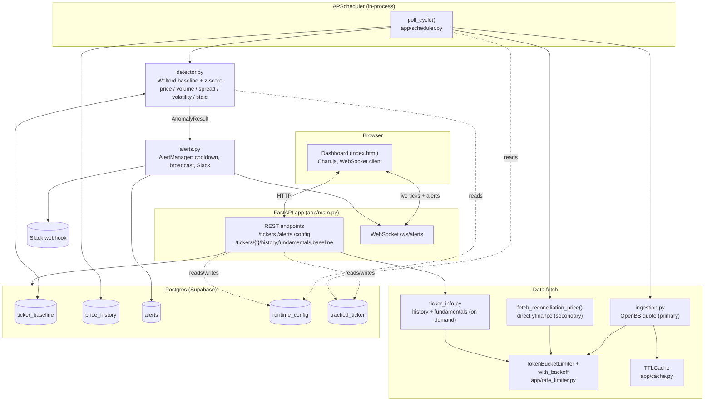

# Market Anomaly Alerts

A Python backend that polls market data (via [OpenBB](https://openbb.co/)) and detects
five independent kinds of anomaly against a per-ticker rolling baseline — price moves,
volume spikes, bid/ask spread widening, tick-to-tick volatility clustering, and stale/halted
quotes — plus a separate price reconciliation check against a second, independently-fetched
reading of the same ticker. Pushes alerts out over WebSocket and Slack, with a live
dashboard to watch it happen. Clicking a ticker opens a detail view (price chart with
selectable range, dividends, next earnings); clicking an alert opens the actual context
that triggered it (signals, baseline stats at the time, a nearby price chart); alert
thresholds are adjustable live from a settings panel; and the tracked
ticker set itself (1-5 tickers) is editable from the dashboard, with each addition validated
against the real data pipeline before being accepted.
Built as a practice project standing in for Bloomberg-style market data API experience,
with a deliberate focus on the mechanics that come up around any rate-limited external
API: throttling, backoff, caching, scalability, and cost tradeoffs.

**Live**: https://market-anomaly-alerts-modonnell.azurewebsites.net (Azure App Service,
Canada Central).

## Architecture



Solid arrows are the live poll → detect → alert path; dashed arrows are the runtime-config
reads/writes that let thresholds and the tracked-ticker set change without a redeploy.

## Design decisions

- **Polling, not push.** Free OpenBB providers don't offer webhooks, and different data
  types warrant different intervals (equities every few minutes during market hours;
  macro data far less often) — tiering poll frequency by data type avoids wasting calls
  on data that hasn't changed.
- **Throttling via a shared token bucket** (`app/rate_limiter.py`), sized below the
  provider's documented cap rather than at it, so a burst of tickers in one poll cycle
  can't trip a 429. Backoff on failure is exponential with jitter.
- **Short-TTL caching** (`app/cache.py`), on the order of seconds. Anomaly detection
  needs fresh data, so this isn't "cache aggressively" — it just collapses duplicate
  fetches for the same ticker within one cycle.
- **Incremental baseline, not full-history rescans.** `TickerBaseline` maintains a
  running mean/stddev per ticker via Welford's algorithm, so each anomaly check is O(1)
  against stored aggregates instead of scanning `price_history`.
- **Debounced alerts.** A per-ticker cooldown (default 30 min) means a ticker that stays
  anomalous for many consecutive polls fires one alert, not one per cycle.
- **In-process WebSocket broadcast for the MVP.** `AlertManager` holds connections in a
  set on a single process. That's a known limit imposed by free tier: scaling to multiple
  instances would mean moving broadcast to Redis pub/sub (or similar) so alerts fan out across
  processes instead of only to clients connected to whichever instance polled the hit.
  Naming this limitation is deliberate — it's the honest answer to "how would this
  scale."
- **Rule-based detection (z-score).** Keeps the MVP explainable. Swapping in a
  model later is a natural extension.
- **Five signals tracked as independent series, one shared sample count** (price, volume,
  bid/ask spread, tick-to-tick delta magnitude, and a stale-quote counter). A ticker can be
  flagged for any combination — surfaced separately in the alert message (e.g.
  `"price+volume"`) rather than collapsed into one generic "anomaly" score.
  - **Spread** (`ask - bid`) is data we already fetch for the midpoint price calculation —
    tracking it as its own baseline cost nothing in new API calls, and a widening spread is
    a standard illiquidity/market-stress signal.
  - **Volatility clustering** is proxied as `abs(price - previous_price)` tracked as its own
    baseline — a ticker can have a perfectly normal-looking price while its *tick-to-tick
    movement magnitude* has shifted regime, which a price z-score alone can't see.
  - **Stale/halted detection** flags when price and volume are both unchanged for several
    consecutive polls — the same instinct as the daily-bar-vs-live-quote bug found earlier
    in this project, now automated instead of found by hand.
- **Price reconciliation as a separate check, not another baseline signal.** Cross-checks
  the primary OpenBB quote against a second reading fetched directly via `yfinance`
  (bypassing OpenBB's wrapper). Worth being honest about what this proves: both
  ultimately trace back to Yahoo Finance, so it's nreot two unrelated vendors — but it's a
  genuinely different code path/endpoint, and a large discrepancy is still a legitimate
  signal (stale cache, a bad read, a provider-side data issue). Uses its own cooldown key
  (`{ticker}:reconciliation`) so it never competes with or gets suppressed by a
  price/volume/spread/volatility alert on the same ticker.
- **Alert context is captured at trigger time, not reconstructed later.** The `Alert` row
  stores a JSON snapshot (which signals fired, the baseline mean/stddev at that moment) at
  the exact point in `scheduler.py` where the alert already fires — everything needed is
  already computed right there. The alternative (showing today's baseline when someone
  later opens an old alert) would be quietly wrong, since the baseline keeps evolving.
- **Alert thresholds live in Postgres (`RuntimeConfig`), not just `.env`.** Once that
  singleton row exists, it's the permanent source of truth — a later env var change has no
  effect. That's intentional: it's what makes the settings panel able to change real
  alerting behavior without a restart. Seeded once in the FastAPI `lifespan`, before any
  request is accepted, specifically so two concurrent first-requests can't race to insert it.
- **Ticker/alert detail views are modals, not separate pages** — keeps the existing
  WebSocket connection alive rather than re-establishing it on navigation. Charting is
  Chart.js via CDN (a real external dependency, a deliberate tradeoff for a working
  interactive chart in a few lines instead of hand-rolling SVG rendering).
- **A manual test-trigger endpoint** (`POST /debug/test-alert/{ticker}?kind=price|volume|spread|volatility`)
  fires a real alert — through the same storage/broadcast/Slack path as a genuine
  detection — using a synthetic value computed against the current baseline. It's
  read-only against the baseline itself, so demoing the alert path doesn't skew real
  stats with fake data. ("stale" isn't synthesizable as a single value — it's a multi-poll
  state, exercised only by the real poll cycle.) Exists because waiting on real 3-sigma
  market moves to demo the
  system isn't practical.

## Setup

```bash
python -m venv .venv
.venv\Scripts\activate
pip install -r requirements.txt
cp .env.example .env
```

Create a local Postgres database matching `DATABASE_URL` in `.env` (or point it at a
free Supabase/Neon instance). Tables are created automatically on startup.

## Run

```bash
uvicorn app.main:app --reload
```

- `GET /` — live dashboard (real-time prices, z-scores, alert feed, test-trigger buttons)
- `GET /tickers` — tracked tickers and poll interval
- `POST /tickers/{ticker}` — add a tracked ticker (max 5, auth required); validates by
  actually calling the live ingestion path before persisting, not just checking format
- `DELETE /tickers/{ticker}` — remove a tracked ticker (min 1, auth required)
- `GET /alerts` — recent alerts
- `GET /alerts/{id}` — a single alert's full context (signals/baseline snapshot at trigger
  time) plus a nearby slice of `price_history` for a context chart
- `GET /tickers/{ticker}/baseline` — current rolling mean/stddev for a ticker
- `GET /tickers/{ticker}/history?range=1D|1W|1M|3M|1Y` — OHLC price series for the ticker
  detail chart
- `GET /tickers/{ticker}/fundamentals` — recent dividends + next earnings date/estimate
- `GET /config` — current alert thresholds
- `POST /config` — update one or more thresholds (auth required, same as test-alert)
- `POST /debug/test-alert/{ticker}?kind=price|volume|spread|volatility` — demo/testing
  only, see above
- `WS /ws/alerts` — live price ticks + alert stream (what the dashboard subscribes to)

## Notes

- Default tracked tickers and thresholds live in `.env` — see `.env.example`.
- Ingestion uses `obb.equity.price.quote`, not `historical()` — historical() defaults to
  daily bars, which silently never shows price movement when polled every few minutes.
  OpenBB's Python interface has shifted across versions; verify against `obb.coverage` /
  the installed package's docs if this call doesn't match.
- `openbb` is imported at module load in `app/ingestion.py`, not deferred into the
  function that runs via `asyncio.to_thread` — OpenBB's first import registers a SIGTERM
  handler, which Linux only allows from the main thread (Windows is lenient about this,
  so it can look fine locally and fail silently, every single poll, once deployed).
- Slack alerts are optional — leave `SLACK_WEBHOOK_URL` blank to skip them.
- `/debug/test-alert` requires `X-Debug-Token` to match `DEBUG_TOKEN` (fails closed —
  unset means every request is refused). The dashboard's `GET /` is rendered, not served
  as a static file, specifically so the token gets substituted from the environment at
  request time and the real secret never lands in the committed HTML/git repo. Worth
  being honest about the actual security this buys: the token is still visible via
  view-source on the rendered page (the dashboard's own buttons need it to work), so
  this stops casual/automated hits on the endpoint, not someone deliberately reading the
  page's JS. Good enough for a demo project's debug surface, not a substitute for real
  auth on anything that matters more.
- No migration tool (Alembic, etc.) — schema changes to existing tables need a manual
  `ALTER TABLE`, since `Base.metadata.create_all()` only creates missing tables, it
  doesn't alter existing ones.

## Ideal next steps

- Batch multi-symbol requests where the provider supports it, and move polling from a
  single loop to a queue of per-ticker jobs pulled by multiple workers — the path to
  scaling from a handful of tickers to hundreds.
- Move alert broadcast to Redis pub/sub so it works across multiple app instances (two
  instances of this app polling the same DB independently, each with its own in-memory
  cooldown state, is a real and current limitation — not hypothetical).
- Pipe daily aggregates into Snowflake as a reporting layer.
- Adopt Alembic once schema changes need to happen without direct DB access.
